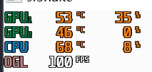

# 贪吃蛇游戏设计说明

---

## Game.cpp游戏主入口设计

### 主要方法

在 `Game.run()` 方法中
```c++
while (window_.isOpen())
```
这是游戏主循环。
```c++
while (timeSinceLastUpdate > TimePerFrame_)
```
这是游戏控制帧率的逻辑循环和渲染循环。

由于是单线程，逻辑和渲染没有分离（我也不会写），所以在游戏中锁死了 100fps 的帧率，但是在正常的电脑上都可以跑，核显都很流畅。  
```c++
Game.handleInput(); // 处理输入
Game.update(sf::Time delta); // 处理游戏更新
Game.render() // 处理游戏渲染
```
上述方法会将参数传递给当前的界面进行操作

### 类静态成员

游戏中的全局参数设置为类的静态成员

**全局资源类** `Game::Color` 类设定了全局的颜色，定义了蛇、水果、网格、背景、按钮、文字的颜色，根据谷歌的配色方案，做到协调统一。

**全局窗口大小设置** `Game::GlobalVideoMode` 设定窗口长宽比为桌面分辨率的一半，同时所有的界面缩放和按钮缩放都是与 `Game::GlobalVideoMode.width` 关联的常数，保证了不同分辨率屏幕下一致的体验。

**全局字体** `Game::GlobalFont` 和**全局标题动画** `Game::GlobalTitle` 保证了不同界面中字体和标题动画的一致性。

**网格可见性** `Game::GridVisibility`、**网格颜色** `Game::GridColor`、**背景颜色** `Game::BackgroundColor`是全局设置，在设置界面调整之后可以全局生效。

**键盘锁、鼠标锁**，防止多次按钮触发和鼠标连续操作。

**主界面智能指针** `Game::MainScreen`，指向当前界面对象。

**界面辅助指针** `Game::TmpScreen`，指向当前界面的前面一个对象，便于用返回按钮返回原来界面。

**游戏界面指针** `Game::TmpGameScreen`，指向游戏界面对象，在暂停界面中使用。

---

## 界面设计

全部使用鼠标操作，点击按钮切换界面或者选项，只有在游戏主界面中可以使用键盘操作。

统一UI设计，统一全局颜色。

界面包括

- 菜单界面 MenuScreen
- 游戏主界面 GameScreen
- 暂停界面 PauseScreen
- 选项界面 OptionScreen
- 游戏结束页面 GameOverScreen
- 帮助界面 HelpScreen
- 关于界面 AboutScreen

此处介绍菜单界面和游戏主界面，其他的界面比较简单而且架构类似，基本上就是布局上的区别。

### 菜单界面 MenuScreen

自己设计了贪吃蛇标题，也设计了统一的按钮和交互逻辑。这是游戏的主入口。其中有按钮、选项按钮、游戏标题动画。

#### 按钮元素 Button

按钮元素使用自己画的UI设计，图片渲染，当鼠标在这个圆形内部的时候，整体颜色加上一层绿色的覆盖。点击可跳转，同时加上鼠标锁防止多次点击，0.5秒之后解锁。

按钮元素在所有界面中都有，可复用程度高。

#### 选项按钮元素 OptionButton

这个元素用于文字选项，在鼠标移动到文字上时，文字增加下划线，文字点击后更改颜色，并根据需要跳转界面。

选项按钮元素在菜单界面、暂停界面、游戏结束页面和选项界面中使用，可以复用

### 游戏主界面 GameScreen

游戏主界面中包含蛇、水果、网格（可选）、暂停按钮、实时分数

#### 蛇元素 Snake

**一、蛇的定义**

蛇由蛇头、蛇身体、蛇关节组成。

蛇头是自己绘制的蛇头图片，身体是半径为 $r$ 的黄色圆形，关节是长乘宽为 $r \times \sqrt{3}r$ 的黑色矩形。

路径节点用一个 `deque<SnakePathNode>` 存储，每次更新游戏数据的时候，根据前进方向 `direction_` 在头位置插入一个（或者两个，如果加速的情况下）路径节点，同时判断尾部节点是否有需要加长的部分，如果需要加长则不删除，否则删除尾部节点（或者两个）。

每个身体节点由10个路径节点定义，每个关节节点是相邻两个身体节点的中间节点，其法向方向由相邻两个关节的差向量决定。

即对于一个长度为 $x$ 的蛇（不包括头），蛇头定义为第0个节点，则`deque`的长度为 $10x + 1$，第 $10k$ 个节点为身体节点， 第 $10k + 5$ 个节点是关节节点。

相比源代码中使用的 `vector<SnakeNode>`，`SnakeNode` 类中有方向和位置信息，而现在的`deque<SnakePathNode>`中只存储了位置信息，空间占用率降低了。同时源代码中的蛇更新需要 `vector` 整体向前移动一位，时间复杂度 $O(n)$；现在使用 `deque` 只需要操作头尾结点，时间复杂度 $O(1)$。

**二、蛇的渲染**

保证在越过边界之后会从对面边界穿出。源代码中直接将蛇节点修改到对面的位置，在源代码的条件下是可以的。但是修改版的代码中，中间节点的方向是又前后两个身体节点共同定义，可能会导致方向计算错误和渲染中的bug。

解决方案是，更新时不修改蛇相对屏幕位置，而每一帧判断尾结点是否在屏幕内，再根据尾结点位置统一修正所有蛇节点，保证了蛇不会因为长时间游戏而跑到很远的地方导致数据溢出。同时定义了 `toWindow()` 函数计算节点在屏幕中的位置，保证蛇能够在正确位置渲染和根据首节点位置进行交互。

当身体节点一部分在边界内的时候，应该会有一部分渲染在对面的位置，否则就会在对面突然出现一个节点，不够优雅和丝滑。所以我判断了是否这个节点的渲染半径包含边界，包含的话，就让它在对面也渲染一次。

**三、蛇的游戏逻辑判定**

当蛇头渲染半径和水果的渲染半径相切的时候，判定为吃到水果，则获取水果的得分。

当蛇头渲染半径与30个路径节点以外的路径节点渲染半径相交的时候，判断为死亡。这里的30个路径节点保证了一部分锐角转弯的可能性。

#### 水果元素 Fruit

水果元素源代码中用 `vector` 存储，这里改成 `deque` 存储，也是便于修改删除节点。同时源代码中的水果元素是类，而我修改成结构，因为水果类的成员不多，没有私有的必要，而且大多需要在外部访问。

水果的得分也是直接写死在结构里面，在随机生成水果的时候就写死了。

#### 网格元素 Grid

网格使用与屏幕长宽相关的条状矩形渲染。

---

## 性能

原版：


改版：
